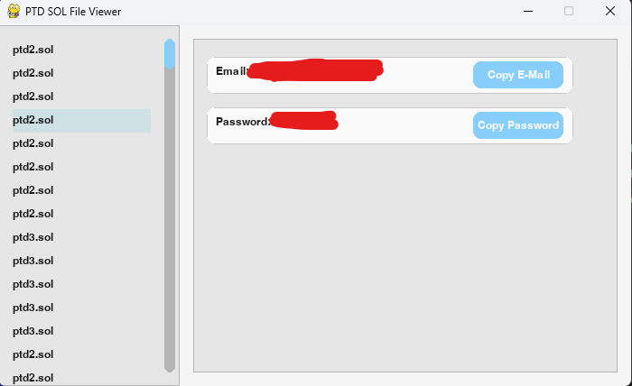

# PTD SOL File Viewer

This Python application provides a graphical user interface (GUI) for viewing and extracting information from `.sol` (Shared Object) files, specifically targeting those related to "Pokemon Tower Defense" (PTD) games. It helps users easily find and copy saved email and password credentials stored within these files.

## Features

- **Automatic .sol File Discovery**: Scans common Flash Player save locations across Windows, macOS, and Linux for `.sol` files.
- **PTD-Specific Filtering**: Focuses on `.sol` files that likely belong to Pokemon Tower Defense games.
- **Credential Extraction**: Identifies and extracts "Email" and "Password" strings from selected `.sol` files.
- **User-Friendly Interface**: Displays a list of found `.sol` files and the extracted credentials in a clean, interactive GUI.
- **Copy to Clipboard**: Provides convenient "Copy E-Mail" and "Copy Password" buttons to quickly transfer extracted data.
- **Robust Parsing**: Handles various `.sol` file structures and includes a timeout mechanism for large or complex files to prevent freezing.

## Screenshots



## Requirements

- Python 3.x
- `pygame` library
- `pyperclip` library

You can install the required libraries using pip:
```bash
pip install -r requirements.txt
```

## How to Run

1.  **Clone the repository (or download the files):**
    ```bash
    git clone https://github.com/acelyakilic/PTDSolEditor.git
    cd PTDSolEditor
    ```
2.  **Install dependencies:**
    ```bash
    pip install -r requirements.txt
    ```
3.  **Run the application:**
    ```bash
    python sol_viewer.py
    ```

The application will automatically search for `.sol` files in standard Flash Player directories. If a file named `sol` (without an extension) exists in the same directory as `sol_viewer.py`, it will also be listed and prioritized.

## File Locations Searched

The application searches for `.sol` files in the following typical Flash Player save locations:

-   **Windows:** `%APPDATA%\Macromedia\Flash Player\`
-   **macOS:** `~/Library/Preferences/Macromedia/Flash Player/`
-   **Linux:** `~/.macromedia/Flash_Player/`

It also checks the current working directory for a file named `sol`.

## Contributing

Feel free to fork the repository, make improvements, and submit pull requests.

## License

This project is licensed under the MIT License - see the `LICENSE` file for details.
